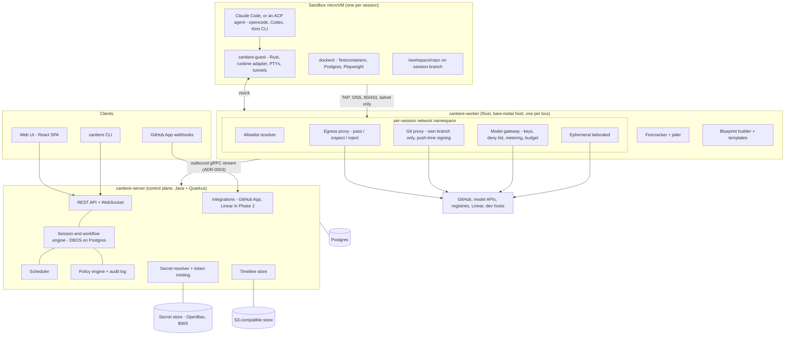
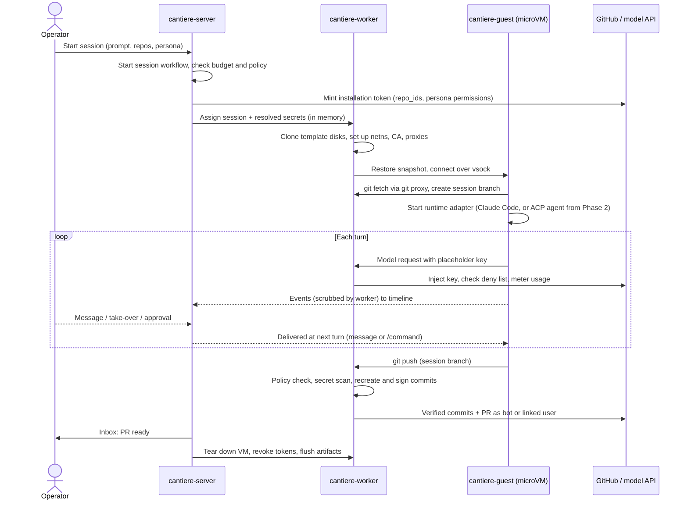

# Cantiere architecture - milestone 1

Milestone 1 is Phase 0 (spike) plus Phase 1 (single-session MVP) of [the requirements](requirements.md).
Its exit is one Officina story implemented through PR from the web UI, with no terminal container.
Each decision below links to its ADR in [docs/adr](adr/README.md).

## Principles

1. **The sandbox holds nothing worth stealing.** Credentials are applied at the worker boundary on the way out (ADR-0010); the only documented exception is a user's own subscription login (ADR-0014).
2. **Controls are construction, not prompts.** Permissions live in the VM boundary, the egress proxy, the git proxy and one policy engine (ADR-0007, ADR-0011, ADR-0015).
3. **Host existing CLIs unmodified.** Cantiere owns sessions, isolation, credentials and workflows, not the agent loop (ADR-0002, ADR-0009).
4. **One database.** Postgres for state and workflows, an object store for blobs (ADR-0005, ADR-0006).
5. **Single host first, hosted control plane possible.** Workers dial out and every record carries a tenant ID (ADR-0003, OSS-6).

## Components

| Component | Owns | ADRs |
| --- | --- | --- |
| `cantiere-server` (Java, Quarkus) | API, UI, session workflows, scheduling, policy, audit, timeline, GitHub App, secret resolution | 0003, 0005, 0006, 0012, 0015, 0016 |
| `cantiere-worker` (Rust) | VMs, templates, network namespaces, egress and git proxies, push-time commit signing, model gateway, stream relay | 0007, 0008, 0010, 0011, 0012, 0013, 0014 |
| `cantiere-guest` (Rust) | Runtime adapters (Claude Code native, ACP), event normalization, slash-command discovery, PTYs, editor and VNC tunnels, push wrapper | 0009, 0012, 0013 |
| Config repo | Personas, org blueprint layer, skills reference, workflows later | 0017 |
| Target repos | `.agent/blueprint.yaml`, `CLAUDE.md` / `AGENTS.md` | 0008, 0009 |

The web UI and the CLI (IN-3, IN-4) use the same public REST API, described with OpenAPI and authenticated by session cookie or personal access token (ADR-0016).

## Session lifecycle

## Trust boundaries

| Boundary | What crosses it | Control |
| --- | --- | --- |
| Guest to worker | vsock streams; TAP traffic for DNS, 80/443 and declared tailnet | Firecracker + jailer; nftables default drop in a namespace the guest cannot see (ADR-0007, ADR-0011) |
| Worker to internet | Proxied requests with injected credentials | Allowlist resolver, SNI/Host allowlist, method/path policy, git branch rule, audit (ADR-0010, ADR-0011, ADR-0015) |
| Worker to server | One outbound authenticated gRPC stream | Per-worker credential, revocable; secrets only per session in memory (ADR-0003) |
| Browser to server | HTTPS, WebSocket | Passkey or OIDC session, PATs for CLI (ADR-0016) |
| Browser to sandbox content | Editor, terminal and browser view served from the guest | Separate per-session origin with a capability token, no Cantiere cookies, strict CSP (ADR-0013) |
| Webhooks to server | GitHub events | Signature check, approved installations only (ADR-0012) |

Untrusted content (issue text, PR comments, web pages, tool output) is tagged on the timeline from Phase 1, and the policy engine refuses to let it satisfy high-impact rules from Phase 2 (SEC-6).

## Requirement coverage for milestone 1

| Requirements | ADRs |
| --- | --- |
| SB-1, SB-6, SEC-1 | 0007 |
| SB-2, SB-3, SB-4, SB-5, RT-4 | 0008 |
| RT-1 (partial: Claude Code only; opencode and Codex in Phase 2), RT-2, RT-3, RT-6, KN-1 | 0009, 0008 |
| IN-3, IN-4 | 0016 and the public API above |
| GH-1, GH-2, GH-3, GH-5, GH-6, GH-7, GH-8 | 0012, 0010 |
| UX-1, UX-2, UX-3, UX-4, UX-5 | 0013, 0009, 0005 |
| SEC-2, SEC-3 | 0011 |
| SEC-4, SEC-5 | 0015, 0010 |
| SEC-7 | 0012 |
| ID-1, ID-2, ID-3, ID-4 | 0010 |
| COST-1, COST-2, COST-3 | 0014 |
| COST-4 | 0007 |
| OBS-1 | 0006, 0003 |
| OBS-2, OBS-3 | 0018, 0005 |
| OSS-1 | 0017 |
| OSS-2 | 0019 |
| OSS-3 | 0002 |
| OSS-4 | 0016 |
| OSS-6 | 0003, 0005 |

## Phase 0 spike plan

Phase 0 is timeboxed to one week, so it answers the questions that need only Firecracker, a guest image and the CLIs.
The proxy-dependent checks run in the first Phase 1 slice, before ADR-0012 and the proxy parts of ADR-0010 and ADR-0011 are relied on.
Each item's pass condition is written in its ADR.

| # | When | Question | Pass condition | ADR |
| --- | --- | --- | --- | --- |
| 0 | Phase 0 | Build vs reuse | OpenHands runtime, Coder, E2B runtime and microsandbox measured against items 1 to 4; results recorded in ADR-0007 | 0002, 0007 |
| 1 | Phase 0 | Restore time | < 2 s p50, < 30 s p99 to guest-ready | 0007 |
| 2 | Phase 0 | Officina suites in a guest | `officina` and `officina-site` tests incl. Testcontainers and Playwright pass | 0007 |
| 3 | Phase 0 | Density | 10 concurrent sessions on 16 cores / 64 GB without OOM | 0007 |
| 4 | Phase 0 | Escape and isolation | With nftables only, root in guest cannot reach the host, peers or metadata; only DNS and ports 80 and 443 to the worker leave the namespace; all drops logged | 0007, 0011 |
| 5 | Phase 0 | Clone identity | Unique entropy, machine ID and network identity per restored clone | 0007 |
| 6 | Phase 0 | Firecracker client | `fctools` drives create, snapshot, restore, balloon and jailer launch for items 1 to 5; otherwise a client generated from `firecracker.yaml` | 0004, 0007 |
| 6a | Phase 0 | Subscription auth signals | With the pinned Claude Code version and a `setup-token` in `CLAUDE_CODE_OAUTH_TOKEN`, `claude auth status` reports `authMethod` `oauth_token`; during a working session the token value is unchanged and no credential is written to the CLI's credential store; with the token revoked or expired, the stream-json output's authentication-failure signal is recorded and the adapter pauses the session instead of failing it | 0009, 0014 |
| 7 | Phase 0 | Headless Claude Code end to end | One Claude Code session takes a prompt to a pushed branch with events streaming, and a user skill dispatched as `/name` runs. The push goes to a throwaway repo with a temporary spike-only credential; it does not validate ADR-0010, which items 8, 10 and 11 do | 0009 |
| 8 | Phase 1, slice 1 | CA, proxy trust and domain allowlist | Claude Code, `git`, `gh`, Docker pulls, Maven and npm work through the proxy with the per-session CA; non-allowlisted domains are denied and every denial is logged | 0010, 0011 |
| 9 | Phase 1, slice 1 | Model gateway | Claude Code runs end to end against the gateway with a placeholder key; usage metered and priced from the config-repo price table | 0014 |
| 10 | Phase 1, slice 1 | GitHub API policy | Session token cannot update refs, merge, or mutate other repos via REST or GraphQL | 0010 |
| 11 | Phase 1, slice 1 | Push-time signing | Recreated bot and user commits show Verified and keep trees | 0012 |
| 12 | Phase 1, slice 1 | Durable step atomicity | A DBOS step that writes a row through the jOOQ step factory and is killed before returning leaves both the row and the checkpoint, or neither | 0006 |
| 13 | Phase 1, slice 1 | OpenBao dynamic credentials | A PostgreSQL role and a MySQL user issued with a TTL equal to the session maximum stop working, and their open connections are closed, at session end by server revocation and at expiry with the server stopped, including for a guest that reconnects in a loop during revocation; SSH through the worker agent works during the session and fails after it ends, even with the certificate copied out of the guest | 0010 |

The original Phase 0 item "test broker-held subscription credentials" is answered by research instead of a test: Cantiere stores the subscriber's own `setup-token` and places it in their sessions' guest environment, without proxying it, as a residual terms risk that needs owner sign-off (ADR-0014).

## Open questions after these ADRs

- [ ] Memory: keep file-based `MEMORY.md` or move to a store with a review UI (RT-5, Phase 3). Not needed for milestone 1; skills and memory mount read-only from the pinned skills commit (ADR-0008).
- [ ] Which Hetzner dedicated model and location runs the first worker (16 cores / 64 GB or larger); Hetzner Cloud cannot host workers (ADR-0007).
- [ ] Workflow script language for WF-2 (Phase 2), built on ADR-0006 primitives.
- [ ] Which ACP agents the Phase 2 template ships (opencode and `codex-acp` at minimum), and whether each passes the ADR-0009 conformance suite.
