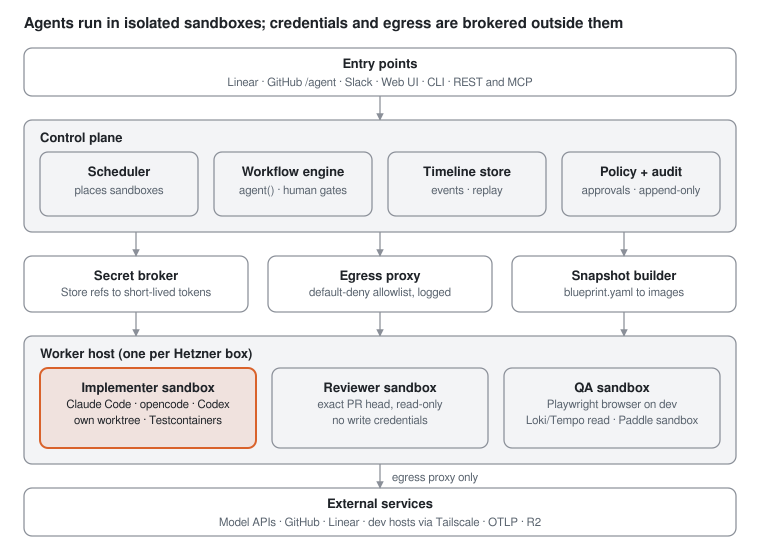

# Officina Agent Platform - Requirements

Oct 4, 2026 · @Noah

Build an open-source, self-hosted agent platform that gives every Officina task its own disposable sandbox, starts from Linear or Slack, and is driven and reviewed from a browser instead of terminal windows.

## Problem and goals

Today each agent runs in a long-lived Docker container per CLI (`claude-dev-container`, `opencode-dev-container`, `codex-dev-container`), attached to a terminal window. That setup works, but it scales with the number of terminals one person can watch, not with the backlog.

### Observed pain in the current setup

| Pain | Evidence in the current setup |
| --- | --- |
| No per-task isolation | One `/workspace` bind mount shared by every session; 30+ hand-made `*-wt-off*` worktree folders accumulate in it |
| Over-broad credentials | Every long-lived credential is available to every session as env vars, whatever the task |
| Host escape surface | Containers run with host-level privileges |
| Shared-state contention | Concurrent `codex exec` runs fight over one `~/.codex` lock; memory and skills live in one shared volume |
| Session history is siloed | Each CLI saves its own transcripts on the host (Claude Code in `~/.claude/projects`, resumable with `--resume`; Codex in `~/.codex/sessions`), but nothing links them to the ticket or PR, searches across CLIs, or shows them off that host |
| Status tracking is manual | Agents hand-move Linear status and post review evidence; nothing aggregates what is running, blocked or waiting |
| Hard to hand off | No way to take over or watch a session from another device except via claude.ai background jobs |

### Goals

1. **One task, one sandbox:** every session gets a fresh, snapshot-booted environment with only the repos and credentials that task needs.
2. **Ticket-driven start:** assigning a Linear issue (or mentioning the agent in Slack or a PR) starts a session, with no terminal.
3. **Observable and steerable:** a web UI shows each session's plan, shell, editor, browser and timeline, live or replayed, and lets a human take over.
4. **Process-native:** the Officina engineering workflow (skills, TDD, adversarial review gate, Codex review + Opus adjudication, IDR QA) runs as first-class workflows, not prose in a prompt.
5. **Model- and harness-agnostic:** Claude Code, opencode, Codex CLI and future CLIs run as pluggable agent runtimes inside the same sandbox contract.
6. **Open source and self-hostable:** runs on one Hetzner box first, scales to a small fleet, Apache-2.0 licensed.

### Success measures

- Run 10 or more concurrent sessions on one host without cross-talk (today: about 3 to 4 terminals).
- Zero long-lived credentials inside a sandbox: every secret short-lived and scoped to the session (subscription mode excepted, see COST-3).
- Every merged Officina PR traceable to a session record (plan, commands, review evidence).
- Retire the three terminal containers for day-to-day Officina work.

## What Devin does

Devin's value is the operating model around the agent: snapshot-booted VMs per session, ticket and chat entry points, codebase indexing, reusable knowledge, and orchestrated child sessions. The agent loop is the commodity part.

| Capability | How Devin does it | Adopt for Officina? |
| --- | --- | --- |
| Session sandbox | Fresh VM per session, booted from the org's active snapshot; nothing persists between sessions ([blueprints](https://docs.devin.ai/onboard-devin/environment/blueprints.md)) | Yes - core |
| Environment as code | YAML blueprints (Initialize, Maintenance, Knowledge, Post-build), org blueprint plus per-repo layers, rebuilt on save and about every 24h | Yes - as files in the repo, not a settings UI |
| Workspace | Shell, editor, browser in one session; Sept 2026 UI adds tabs, split editors, a Checks tab and a sub-session tree ([release notes](https://docs.devin.ai/release-notes/overview)) | Yes |
| Entry points | Web, Slack/Teams mention, CLI, Desktop, native Jira agent, Linear ([Linear](https://docs.devin.ai/integrations/linear.md)), `/devin` on GitHub PRs ([GitHub](https://docs.devin.ai/integrations/gh.md)), REST API, MCP server | Linear, GitHub, Slack, web, CLI, API, MCP |
| Codebase Q&A | Ask Devin answers with citations on indexed repos and can launch a session from the chat ([Ask Devin](https://docs.devin.ai/work-with-devin/ask-devin.md)); DeepWiki generates repo wikis ([DeepWiki](https://docs.devin.ai/work-with-devin/deepwiki.md)) | Yes, phase 2 |
| Knowledge | Trigger-retrieved entries scoped by repo or org, auto-suggested from feedback; migrating to Skills inside Plugins that bundle skills, rules and MCP servers ([knowledge](https://docs.devin.ai/product-guides/knowledge.md)) | Yes - our `skills/` + memory already fit this shape |
| Multi-agent | Dynamic Workflows: a script calls `agent()` to spawn child sessions on their own VMs with structured JSON output, `pipeline()` stages, resumable runs ([dynamic workflows](https://docs.devin.ai/work-with-devin/dynamic-workflows.md)) | Yes - core for staff-engineer and review gates |
| Review | `/devin review` on PRs; Devin Review across GitHub, GitLab, Bitbucket | Replace with our own gate (Codex + Opus) |
| Automations | Scheduled sessions and event-triggered automations with preflight checks | Yes |
| Secrets | Org, repo, session and personal scopes, injected only when needed; OIDC cloud auth ([secrets](https://docs.devin.ai/product-guides/secrets.md), [OIDC](https://docs.devin.ai/product-guides/oidc.md)) | Yes, stricter - no org-wide standing secrets |
| Deployment | SaaS; enterprise dedicated deployments; SOC 2 Type II ([security](https://docs.devin.ai/enterprise/security-access/security/enterprise-security.md)) | Self-hosted only |
| Pricing | Pro $20/mo, Max $200/mo, Teams from $80/mo, enterprise ACU caps ([billing](https://docs.devin.ai/admin/billing/self-serve.md)) | Replace with model-API spend metering per session |
| Coding model | SWE-2, Cognition's own model post-trained from Kimi K3, runs only inside Devin products (see SWE-2 model below) | No - closed; run Kimi K3 through opencode instead |

### SWE-2 model

SWE-2 cannot run on this platform: it has no API, no weights and no self-host path, and building a model is out of scope.

| Fact | Detail |
| --- | --- |
| Release | 2026-09-10, by Cognition |
| Base | Kimi K3 (Moonshot AI, 2.8T parameters, 1M context), post-trained with RL for cost and capability together |
| Effort levels | Medium, High (recommended), Max |
| Claimed gains vs SWE-1.7 | 58% fewer turns, 81% lower cost, first code edit at median step 18 instead of 48 |
| Benchmarks | FrontierCode 1.1: 50.0% vs Fable 5.1 at 50.9%; Terminal-Bench 4: 27.3% vs GPT-6 Astra at 57.9%; each model scored in its own harness, so not like-for-like |
| Price | $3 input / $15 output per 1M tokens list price (free on self-serve plans through Oct 15, 2026; $0.75 / $3.75 for credit-based enterprise customers through Dec 31, 2026); Devin credit multiplier 6 / 9 / 12 by effort |
| Availability | Devin Desktop (formerly Windsurf), Devin CLI, Devin Web and Fusion only; no public API, no Hugging Face weights, no OpenRouter listing |

What Officina takes from it:

- Run Kimi K3, the open-weights base, as an opencode runtime (RT-1); it is already in use as the optional reviewer.
- Do not wrap Devin CLI as a runtime: it would route code and billing through Cognition's SaaS, against goal 6, and its headless mode is unverified.
- Adopt the design ideas: per-session effort levels (RT-3), turn and stall limits (WF-7), and turns to first edit plus cost per session from the RT-2 event stream (COST-1) to compare runtimes.

Sources: [Devin Docs - AI Models](https://docs.devin.ai/desktop/models), [OrcaRouter - SWE-2](https://www.orcarouter.ai/blog/swe-2), [MarkTechPost - Cognition Releases SWE-2](https://www.marktechpost.com/2026/09/12/cognition-releases-swe-2-a-kimi-k3-post-trained-coding-model-that-matches-fable-5-1-on-frontiercode-at-64-lower-cost/), [Mervin Praison - SWE-2 lags on Terminal-Bench 4](https://mer.vin/news/cognition-swe-2-cheaper-but-it-lags-on-terminal-bench-4/).

### Weaknesses to design against

Independent reviews ([idlen.io](https://www.idlen.io/blog/devin-ai-engineer-review-limits-2026/), [G2](https://www.g2.com/products/devin-ai/reviews)) report the same failure modes our skills already guard against:

- Scope creep and unstated assumptions -> enforce AC-bounded plans and diff-scope checks.
- Repetitive debug loops that burn compute -> loop detection and per-session budget caps.
- Plausible but off-target output on vague tasks -> require Definition of Ready before an implementer session starts.
- Unpredictable cost -> live per-session spend with hard stops.

Not verified from Devin docs: VM takeover, session replay, plan approval, sleep/resume, concurrency caps, network policy and audit logs.

### Open-source starting points

| Project | Covers | Gap for us |
| --- | --- | --- |
| OpenHands | Docker sandbox runtime, shell, editor, browser, web UI, GitHub/GitLab resolver, SDK | Own agent loop; not built around external CLIs, skills or Linear |
| Coder (agent workspaces) | Self-hosted Terraform-defined workspaces, snapshots, network controls | Environment only; no agent orchestration |
| SWE-agent / mini-SWE-agent | Research issue-resolver agent | Benchmark-oriented; no product surface |
| Plandex | Terminal planner with sandboxed diffs | Single-session, terminal-bound |
| Sweep | GitHub issue to PR bot | Activity uncertain; narrow scope |

## Personas and use cases

The primary user is a solo founder-engineer running a team of agents; the agent personas already defined as skills become session types.

| Persona | Who | Needs from the platform |
| --- | --- | --- |
| Operator | The human (you), on laptop or phone | Start, watch, steer, approve, take over, merge; one inbox of what needs a decision |
| Staff engineer agent | `persona-staff-engineer` / `persona-staff-devops` | Spawn and supervise child sessions, read their state, post gate evidence to Linear |
| Senior engineer agent | `engineering-workflow` | Clean repo checkout, toolchain, test DBs (Testcontainers), PR rights on one branch |
| Platform/SRE agent | `persona-platform-sre` | Scoped cloud creds (Hetzner, Cloudflare, BWS), workflow dispatch, Tailscale reach to dev hosts |
| QA agent | `qa-verification` | Real browser against dev, Loki/Tempo read, Paddle sandbox, evidence upload |
| Reviewer agents | Codex, Opus adjudicator, DeepSeek sweep, Kimi | Read-only checkout of a PR head, no write creds, structured findings output |
| Contributor (open source) | Other teams adopting the tool | Install on their own host, bring their own repos, models and workflows |

### Primary use cases

1. Assign OFF-1234 to the agent in Linear; a staff-engineer session triages, plans, spawns an implementer, runs the review gate, and stops at "ready to merge" for approval.
2. Mention the agent on a PR comment; a session picks up the PR branch, addresses the comment, pushes, and replies in thread.
3. A story enters In Deployment Review; a QA session verifies AC on dev and posts evidence or moves it back to In Progress.
4. A PagerDuty incident fires; an SRE session investigates read-only and files a `[Investigation]` issue.
5. From a phone, check every running session, answer a blocking question, approve a merge.
6. Take over a stuck session's shell or VS Code in the browser, fix one thing, hand control back.
7. Ask a codebase question ("where is tenant placement decided?") against an indexed repo without starting a full session.

## Functional requirements

Priorities use MoSCoW: M = must (Phase 1 or 2), S = should (Phase 2 to 4), C = could (Phase 4 or later), W = won't do. Each ID is meant to become one or more OFF stories.

### Sessions and sandboxes

| ID | Requirement | Pri |
| --- | --- | --- |
| SB-1 | Each session runs in its own microVM sandbox (SEC-1) booted from a prebuilt snapshot in under 30 s | M |
| SB-2 | Environment is defined as code in the repo (`.agent/blueprint.yaml`): base image, toolchains, repo clones, setup and maintenance commands, services | M |
| SB-3 | Snapshots rebuild on blueprint change and nightly; a failed build keeps the last good snapshot and alerts | M |
| SB-4 | Multi-repo sessions: clone several repos (e.g. `officina`, `officina-site`, `linear-config`) with per-repo blueprint layers | M |
| SB-5 | Each session gets a git branch and worktree it owns; no shared working copy between sessions | M |
| SB-6 | Sidecar services per session: Docker-in-sandbox or rootless Podman for Testcontainers, Postgres, Playwright browsers | M |
| SB-7 | Sessions can pause (suspend VM, free CPU) and resume with full state; idle sessions auto-pause after a configurable timeout | S |
| SB-8 | Session fork: clone a running session's state to try an alternative | C |
| SB-9 | GPU passthrough for local STT/model workloads | W |

### Agent runtimes

| ID | Requirement | Pri |
| --- | --- | --- |
| RT-1 | Pluggable runtime adapters run existing CLIs headless inside the sandbox: Claude Code, opencode, Codex CLI; adding a CLI is a config + adapter, not a fork. Phase 1 ships Claude Code; opencode and Codex CLI follow in Phase 2 through an ACP adapter (ADR-0009) | M |
| RT-2 | Adapters normalize a common event stream (messages, tool calls, file edits, commands, cost) into the session timeline | M |
| RT-3 | Per-session model and effort choice, with org defaults and a deny list (e.g. never Fable 5), enforced at the model gateway for API-key sessions and only by the runtime adapter in subscription mode (ADR-0014) | M |
| RT-4 | Skills, agents and memory mount read-only from a versioned source (the `claude-dev-container/skills` repo), synced per runtime's expected layout | M |
| RT-5 | Memory writes from a session go through a review queue before merging into shared memory | S |
| RT-6 | Per-session runtime home (`CODEX_HOME`, `~/.claude`) so concurrent sessions never share lock files | M |

### Entry points and integrations

| ID | Requirement | Pri |
| --- | --- | --- |
| IN-1 | Linear: assigning an issue to the agent user, or a label, starts a session of the configured persona; progress posts back as comments and status moves | M |
| IN-2 | GitHub: `/agent <prompt>` on a PR or issue starts or resumes a session; review comments on a session's PR route to that session | M |
| IN-3 | Web UI: start a session from a prompt, a Linear ID, or a template | M |
| IN-4 | CLI: `officina-agent run/ls/attach/logs/stop` against the server, so terminal workflows keep working | M |
| IN-5 | REST + webhook API, and an MCP server so other agents can start and query sessions | M |
| IN-6 | Slack: mention in a thread starts a session; blocking questions and approvals arrive as DMs | S |
| IN-7 | PagerDuty: incident webhook starts a read-only SRE investigation session | S |
| IN-8 | Scheduled sessions (cron) and event automations, e.g. a story entering In Deployment Review triggers QA | S |

### GitHub App and user identity

Each deployment registers its own public GitHub App, so it can work on any user's or org's repos once the app is installed there with the required permissions. Devin uses the same model with one app owned by Cognition ([GitHub integration](https://docs.devin.ai/integrations/gh.md)). Users can also link their GitHub account so PRs and commits from their sessions are authored by them.

| ID | Requirement | Pri |
| --- | --- | --- |
| GH-1 | Setup registers the deployment's GitHub App in one click from a shipped app manifest; the app private key and webhook secret go straight to the secret store (ID-1) | M |
| GH-2 | The app is registered as public ("Any account"), so one deployment serves repos across users and orgs | M |
| GH-3 | The control plane records every installation (account, installation ID, repos, granted permissions) and acts only on installations and repos an operator approved; webhooks from other installations are dropped and logged | M |
| GH-4 | PR and issue commands (IN-2) start or steer a session only when the commenter has write access to the repo and is an approved user | M |
| GH-5 | Session tokens (ID-2) are minted from the installation that owns each target repo, limited to that repo and the persona's declared permissions; reviewer and QA tokens carry no write permissions | M |
| GH-6 | Users link their GitHub account through the app's user authorization (OAuth); the server keeps the refresh token in the secret store, and short-lived user access tokens are applied only at the worker, never inside the sandbox (ADR-0010); user tokens cannot be narrowed to the persona's permissions, so every use passes the persona's policy check (ADR-0015) and is audited (SEC-5); tokens are requested restricted to the session's target repo (GitHub's repository\_id parameter) where GitHub allows it, as defense in depth only (ADR-0012) | M |
| GH-7 | Per persona or session, PRs, commits and comments are authored as the app bot (default) or as the linked user; reviewer personas always post as the bot | M |
| GH-8 | In user-authored mode, commits are signed with a key registered to that user's GitHub account so they show as Verified; otherwise the bot stays committer and the user is credited as co-author (SEC-7) | M |
| GH-9 | Unlinking revokes the user's token at GitHub and pauses that user's running sessions to the inbox | S |
| GH-10 | GitHub Enterprise Server: the same app model against a configurable GitHub host | C |

### Observe, steer, take over

| ID | Requirement | Pri |
| --- | --- | --- |
| UX-1 | Session list: state (running, waiting on human, paused, done, failed), persona, issue, branch, PR, elapsed, spend | M |
| UX-2 | Session view: chat, plan with checklist, live terminal, file diff, browser view, and a timeline of every command and tool call | M |
| UX-3 | Send messages mid-run; the runtime receives them at its next turn | M |
| UX-4 | Take over: open the sandbox shell or browser VS Code (code-server) and hand control back | M |
| UX-5 | Replay: a finished session's timeline stays browsable with commands, output and diffs | M |
| UX-6 | Inbox: one queue of items needing the human (questions, approvals, merge requests, failed gates), with push notification | M |
| UX-7 | Mobile-friendly web UI for inbox, session list and approvals | M |
| UX-8 | Sub-session tree for orchestrator sessions | S |
| UX-9 | Voice: push-to-talk input in the web UI (replaces host PTT/STT) | C |

### Orchestration and workflows

| ID | Requirement | Pri |
| --- | --- | --- |
| WF-1 | Sessions can spawn child sessions via API with their own sandbox, persona and scoped creds, and receive structured JSON results | M |
| WF-2 | Declarative workflows (script or YAML) with `agent()`, `parallel()`, `pipeline()` and human gates; runs are resumable | M |
| WF-3 | Ship the Officina workflow as a reference workflow: triage -> plan -> implement (TDD) -> adversarial pre-PR gate -> PR -> Codex review + Opus adjudication (+ shadow Sonnet) -> human merge approval -> deploy -> QA | M |
| WF-4 | Human gates are first-class steps; merge is never automatic without a recorded review on the current head and an approval | M |
| WF-5 | Reviewer sessions receive a read-only checkout of the exact PR head and no write credentials | M |
| WF-6 | Gate evidence (findings, verdicts, model, head SHA) is stored and posted to the PR and Linear issue | M |
| WF-7 | Loop and stall detection: N repeated failing commands or no progress for T minutes -> pause and ask | M |

### Knowledge and codebase understanding

| ID | Requirement | Pri |
| --- | --- | --- |
| KN-1 | Repo context files (`CLAUDE.md`, `AGENTS.md`) and skills load per runtime convention | M |
| KN-2 | Code search and Q&A over indexed repos with file:line citations, without a full session | S |
| KN-3 | Generated, refreshable architecture wiki per repo | C |
| KN-4 | Knowledge suggestions: when a human corrects a session, propose a memory or skill edit as a PR | S |

## Non-functional requirements

Security is the main reason to move off the current containers, so these are all M unless marked.

### Security and isolation

| ID | Requirement | Pri |
| --- | --- | --- |
| SEC-1 | Sandboxes get a VM-grade boundary: a hardware-virtualized microVM such as Firecracker or Cloud Hypervisor; plain containers and userspace kernels such as gVisor do not qualify; no host Docker socket, no `NET_ADMIN`, no unconfined seccomp | M |
| SEC-2 | Default-deny egress with per-blueprint allowlists by domain, enforced outside the sandbox (proxy), with every denied request logged | M |
| SEC-3 | Tailscale or WireGuard reach to dev hosts only for personas that declare it, with a per-session ephemeral node and ACL tag | M |
| SEC-4 | Reviewer and QA sandboxes are read-only for git and production systems by construction, not by prompt | M |
| SEC-5 | Every privileged action the platform executes or forwards (push, merge, workflow dispatch, Linear status change, API calls through the worker proxies, including cloud mutations) is recorded in an append-only audit log with session, persona, head SHA and actor; actions taken with direct credentials or over the tailnet are bounded by credential scope and tailnet ACL instead (ADR-0010, ADR-0011) | M |
| SEC-6 | Prompt-injection posture: content from tickets, PRs, web pages and comments is tagged untrusted in the timeline; high-impact tools require a policy check that untrusted input cannot satisfy | S |
| SEC-7 | Signed commits from a per-session or per-persona key held outside the sandbox (signing via agent forwarding or a signing service) | M |

### Secrets and identity

| ID | Requirement | Pri |
| --- | --- | --- |
| ID-1 | Secrets live in an external store behind a pluggable interface (OSS-3), resolved by reference at session start; OpenBao is the first implementation and the only one that mints dynamic credentials (ID-2); Bitwarden Secrets Manager is supported for static secrets; Vault or Infisical may follow (ADR-0010) | M |
| ID-2 | Credentials are minted per session and short-lived: GitHub App installation tokens scoped to the session's repos, Linear and cloud tokens via broker; apart from the subscription-mode token (COST-3), nothing long-lived enters the sandbox, and in practice only credentials with no injectable header enter it at all (ADR-0010) | M |
| ID-3 | Personas declare required secrets; a session receives only those, never the union | M |
| ID-4 | The platform never passes secrets in argv or writes them to files, logs or the timeline; session output (events, terminal recordings, artifacts) is scrubbed for every known secret value, placeholder and token pattern before it leaves the worker; encoded copies made by guest code are not caught, which is why credentials stay outside the sandbox (ADR-0010) | M |
| ID-5 | Separate bot identities per role where the provider supports it (implementer vs reviewer vs QA), so a reviewer token cannot push | S |
| ID-6 | OIDC from sandbox to cloud providers instead of static keys where supported | C |

### Cost and capacity

| ID | Requirement | Pri |
| --- | --- | --- |
| COST-1 | Live spend per session (tokens x model price), aggregated per issue, persona and day; API-key sessions are metered at the model gateway outside the sandbox, which is authoritative; subscription sessions use runtime-reported usage, a notional API-equivalent figure, and the provider's usage-limit windows are tracked separately | M |
| COST-2 | Budget caps per session and per day, hard for API-key sessions: they are capped at the model gateway outside the sandbox, so spend cannot pass the cap except by provider-side usage a response does not report, which is reconciled on the next request; subscription sessions are capped best effort on their notional spend (COST-1) by the runtime adapter (ADR-0014); at the cap the session pauses and posts to the inbox | M |
| COST-3 | Support subscription-auth runtimes (Claude Code setup-token, ChatGPT sign-in for Codex or opencode) alongside API keys; subscription mode is opt-in and available only when the deployment's single user is both the subscriber and the operator, on infrastructure only they control; multi-user deployments cannot enable it; it places the subscriber's own token in that subscriber's sessions, a permanent exception to ID-2 (ADR-0014) | M |
| COST-4 | One 16-core / 64 GB host runs 10 concurrent sessions at Officina workload; sandboxes have CPU, memory and disk quotas | M |
| COST-5 | Add worker hosts by registration; the scheduler places sessions by free capacity | S |

### Reliability and observability

| ID | Requirement | Pri |
| --- | --- | --- |
| OBS-1 | Control plane survives restart without losing session state; running sandboxes reattach | M |
| OBS-2 | OpenTelemetry traces, metrics and logs export to an OTLP endpoint (Grafana Cloud today), with an `environment` label | M |
| OBS-3 | Session transcripts and artifacts (screenshots, evidence) stored in S3-compatible storage (R2) with retention policy | M |
| OBS-4 | Health and stuck-session alerts route to PagerDuty | S |

### Open-source and operability

| ID | Requirement | Pri |
| --- | --- | --- |
| OSS-1 | Apache-2.0; no Officina-specific code in core - Officina workflows, personas and blueprints ship as a separate config repo | M |
| OSS-2 | Single-host install with one command (Docker Compose or a single binary + systemd); a reference OpenTofu module for Hetzner | M |
| OSS-3 | Pluggable providers: sandbox backend, secret store, issue tracker (Linear first, GitHub Issues/Jira later), chat, object store | M |
| OSS-4 | Single-user auth (passkey / OIDC) in MVP; multi-user with roles later | M |
| OSS-5 | Documented plugin APIs for runtimes and providers, with a conformance test suite | S |
| OSS-6 | Ready for a hosted control plane: control-plane records carry a tenant ID, and workers register and receive work over an authenticated API, so the control plane can later run apart from the sandboxes without a data migration; no billing or cross-customer isolation is built now | M |

## Architecture and build vs reuse

A thin control plane schedules sandboxes and runs workflows; secrets, egress and images are handled by services outside the sandbox, so a compromised agent holds nothing long-lived (except a subscription login, see COST-3).

*Vector diagram - click to open full size and zoom.*

The implementer sandbox is the only one with push rights, and only to its own branch.

| Component | Reuse candidate | Build |
| --- | --- | --- |
| Sandbox runtime | Firecracker (Cloud Hypervisor fallback) | SandboxProvider adapter, image and snapshot pipeline (ADR-0007, ADR-0008) |
| Workspaces and snapshots | devcontainer spec as a later import format (ADR-0008); Coder not adopted (ADR-0002) | `blueprint.yaml` to image pipeline |
| Agent runtimes | Claude Code headless; ACP agents (opencode, codex-acp) | Two runtime adapters + event schema (RT-1, RT-2, ADR-0009) |
| Workflow engine | DBOS Transact (Java) on Postgres (ADR-0006) | Officina reference workflow + gate steps |
| Web UI | code-server, xterm.js, noVNC for browser view (ADR-0013) | Session list, inbox, timeline (ADR-0016) |
| Secrets | OpenBao, Bitwarden Secrets Manager (in use), GitHub App tokens | Per-session broker (ID-2, ID-3) |
| Egress | None adopted: Envoy's SNI proxy is alpha, smokescreen needs explicit proxy settings (ADR-0011) | Rust egress proxy on the worker, allowlist from blueprints (ADR-0011) |
| Observability | OpenTelemetry, Grafana Cloud, R2 | Event schema and dashboards |

## Scope, roadmap and open questions

### Deployment model

Decision: ship self-hosted now; keep a hosted control plane, with sandboxes on customer workers, as the later commercial option (OSS-6).

| Factor | Why self-hosted now |
| --- | --- |
| First customer | Officina is the first user and the success measures are internal; customer isolation, billing, compliance and support would come before the tool is proven on our own backlog |
| Margin | Anthropic forbids paying for, reselling or intermediating Claude usage, and each end user brings their own credentials ([terms](https://code.claude.com/docs/en/legal-and-compliance)); a SaaS earns only a platform fee while paying for KVM compute, whereas self-hosted users pay their own compute |
| Market | Hosted agents (Devin, Codex cloud, Claude Code on the web, OpenHands Cloud) are well funded; vendors paywall self-hosted concurrency, API and integrations, so a complete self-hosted platform is the open gap |
| Trust | Sessions hold repo write access and cloud credentials; regulated, EU and security-conscious teams want that on their own infrastructure, which fits Officina's EU positioning |

Later option: a hosted control plane (UI, workflows, integrations) with customers running sandboxes and holding secrets on their own workers. That is the open-core path GitHub Actions, Buildkite and Tailscale use, and it avoids hosting customer code or credentials. OSS-6 keeps it reachable without building billing or tenant isolation now.

### Out of scope

- Building a new agent loop or model: the platform hosts existing CLIs.
- Hosted SaaS, billing, multi-tenant isolation between customers.
- Desktop app, IDE extension, macOS/Windows/Android sandboxes.
- Automatic merge without a human approval (see WF-4).

### Phased roadmap (one epic per phase)

1. **Phase 0 - Spike (timebox 1 week):** compare OpenHands runtime, Coder, E2B/microsandbox and plain Firecracker for SB-1, SEC-1 and the network-level part of SEC-2 (default deny; the proxy domain allowlist is checked in the first Phase 1 slice); verify the subscription-token auth signals (COST-3, architecture test 6a; the broker-held credential question is answered in ADR-0014); run one Claude Code session headless end to end. Exit: sandbox backend chosen, ADR merged.
2. **Phase 1 - Single-session MVP:** SB-1..6, RT-1 (Claude Code), RT-2..4, RT-6, IN-3, IN-4, GH-1..3, GH-5..8, UX-1..5, SEC-1..5, SEC-7, ID-1..4, KN-1, COST-1..4, OBS-1..3, OSS-1..4, OSS-6. Exit: one Officina story implemented through PR from the web UI with no terminal container.
3. **Phase 2 - Ticket-driven and orchestrated:** IN-1, IN-2, GH-4, IN-5, RT-1 (opencode, Codex CLI), UX-6..8, WF-1..7, SEC-6. Exit: assigning an OFF story runs the full reference workflow to a merge-approval request; reviewers run read-only.
4. **Phase 3 - Always-on:** IN-6..8, SB-7, RT-5, KN-2, KN-4, ID-5, GH-9, COST-5, OBS-4. Exit: terminal containers retired; QA and PagerDuty sessions start without a human.
5. **Phase 4 - Community:** OSS-5, KN-3, SB-8, ID-6, GH-10, GitHub Issues and Jira providers, first external release.

### Open questions

- [x] Build on OpenHands' runtime and UI, or a thin new control plane over Coder/Firecracker? Resolved: a thin new control plane that reuses components at defined seams (ADR-0002); Phase 0 still measures OpenHands, Coder, E2B and microsandbox as evidence.
- [x] Do Claude Code and Codex subscription terms allow headless use from a self-hosted multi-session server, or are API keys required? (COST-3) Resolved in ADR-0014: API keys by default; subscription mode is opt-in for a single-user deployment whose user is both the subscriber and the operator.
- [ ] Project owner sign-off on the residual terms risk of storing the subscriber's Claude setup-token, required before subscription mode ships (ADR-0014).
- [ ] Which host runs it?
- [x] GitHub App vs fine-grained PATs for per-session tokens, given the `noahwhite` vs officina identity split. Resolved: per-deployment public GitHub App with optional user linking (GH-1..10).
- [x] Project name and GitHub home (`noahwhite/*` vs a new org) for the open-source repo. Resolved: Cantiere, public at github.com/noahwhite/cantiere (personal account for showcase; transfer to an org later if needed).
- [x] Self-hosted only, or also a hosted SaaS? Licensing allows both; a SaaS needs Anthropic's Commercial Terms, per-user model credentials (no reselling usage), customer isolation and one public app owned by the operator, as Devin does. Resolved: self-hosted now (see Deployment model).
- [ ] Should memory stay file-based (current `MEMORY.md` index) or move to a store with review UI?
